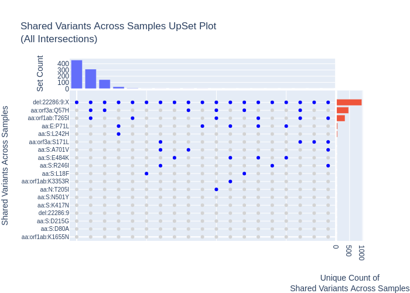

# SARS-CoV-2 analysis scripts

Repository to keep track of miscellaneous SARS-CoV-2 analysis scripts

## Summarise Ivar

Quick script to translate and provide quick human readable breakdown of 
mutations from ivar variants.  Hopefully brings some of the convenience of
the nextclade summaries using the more robust ivar inferences instead of
relying on minimap2 alignments.

Very loosely based on parts of [type_variants](github.com/cov-ert/type_variants).

### Installation

Requires gffutils and pandas to work:

    conda create -n summarise_ivar gffutils pandas
    conda activate summarise_ivar

### Usage

    python summarise_ivar.py --input test/test1_ivar_variants.tsv test/test2_ivar_variants.tsv --output_type summary
    >>> test/test1_ivar_variants.tsv: ['aa:N:R203K', 'aa:N:G204R', 'snp:N:G28882A', 'aa:S:D614G', 'snp:non-coding:C241T', 'aa:orf1ab:P4715L', 'snp:orf1ab:C3037T', 'snp:orf1ab:T7288C', 'snp:orf1ab:A14199G']
    >>> test/test2_ivar_variants.tsv: ['aa:N:R203K', 'aa:N:G204R', 'snp:non-coding:C241T', 'snp:orf1ab:C3037T', 'snp:orf1ab:T7288C']

## Lineage Assignments

Generate pangolin and nextclade lineage assignments before collating results
into a single table containing version metadata for tools and data dependencies

### Installation

Requires nextclade and pangolin to work:

    conda env create -f https://raw.githubusercontent.com/cov-lineages/pangolin/master/environment.yml
    conda activate pangolin
    pip install git+https://github.com/cov-lineages/pangolin
    pip install git+https://github.com/cov-lineages/pangoLEARN.git --upgrade
    pip install git+https://github.com/cov-lineages/lineages.git --upgrade
    conda install -y nodejs 
    npm install --global @neherlab/nextclade

### Usage 

    python assign_lineages.py --input_genomes test/genomes.fa --output lineages.tsv

## Extract Sequences

Extract sequences and metadata from nextstrain ingested GISAID dumps based on a 
pandas query of the metadata e.g. all P.1 sequences.

### Installation

Requires pandas and biopython to work:
    
    conda create -n extract_sequences biopython pandas
    conda activate extract_sequences

### Usage

    python extract_seqs.py --nextmeta metadata_2021-01-08_18-19.tsv --nextfasta sequences_2021-01-08_08-46.fasta --query "pangolin_lineage=='B.1.1.28'" --output_prefix filt_test 

 
## Variant Intersections

Quick tool that uses the [upset_plotly](https://github.com/fmaguire/upset_plotly) 
library (a plotly version of [upsetplot](https://pypi.org/project/UpSetPlot/))
to parse the outputs of a variant checking tool and generate an interactive
upsetplot showing the co-occurrence of specific variants.

Supported inputs:

1. Output csv from [type_variants](https://github.com/cov-ert/type_variants) (must be run with --append-genotypes)
2. Output from [ncov-watch.py](https://github.com/jts/ncov-random-scripts).

### Installation
    
    python -m pip install git+git://github.com/fmaguire/upset_plotly

### Usage

To create a plot for an output from `type_variants`:
   
    python variant_intersections.py -i variant_check.tsv -t type_variants -o example.html 

### Output

## Get Canadian Postcode Longitude/Latitude

Goes through a nextmeta formatted metadata tsv and for any Canadian postcode
entered into the location field (not already in ncov `lat_long.tsv` file) 
uses `pgeocode` to get the correct latitude and longitude.

This geolocation information is then appended to the ncov `lat_long.tsv` file
and output wherever the user specifies.

### Installation

Required pandas and pgeocode
    
    conda create -n pgeocode pandas pip
    pytohn -m pip install pgeocode

### Usage 

    python get_lat_long_for_postcode.py --metadata metadata_2021-01-08_18-19.tsv --lat_longs lat_longs.tsv --output custom_lat_longs.tsv
